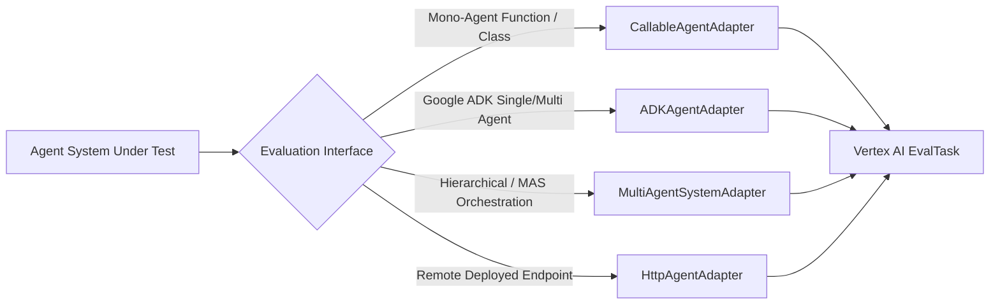

# 🧪 Evaluating Agents & Multi-Agent Systems

This guide explains how to benchmark any agent system—from simple single-turn bots to complex multi-agent orchestrations—using the `agent-eval-framework` test harness.

---

## 🎯 Supported Evaluation Modes



---

## 1. Evaluating a Mono-Agent (Single Function or Class)

Use [`CallableAgentAdapter`](file:///Users/laah/Code/TK%20testing/agent-eval/agent-eval-framework/src/agent_eval_framework/adapters/callable_adapter.py) to wrap any Python function, LangGraph runnable, or class instance.

### Step 1: Provide your Agent Function
```python
# my_agent.py
def query_agent(prompt: str) -> dict:
    # Your agent logic here
    return {
        "response": "Final answer text",
        "trajectory": [{"tool_name": "search", "tool_input": {"query": "sample"}}],
    }
```

### Step 2: Configure YAML (`config.yaml`)
```yaml
experiment_name: "mono-agent-benchmark"
agent_adapter_class: "agent_eval_framework.adapters.callable_adapter.CallableAgentAdapter"

agent_config:
  target: "my_agent:query_agent"
  response_key: "response"
  trajectory_key: "trajectory"

dataset_path: "agent-eval-framework/data/simple.test.jsonl"
metrics:
  - "exact_match"
  - "bleu"
  - "rouge_l_sum"
  - "trajectory_exact_match"
```

### Step 3: Run Evaluation
```bash
python -c "from agent_eval_framework.runner import run_evaluation; run_evaluation('config.yaml')"
```

---

## 2. Evaluating a Multi-Agent System (MAS)

Use [`MultiAgentSystemAdapter`](file:///Users/laah/Code/TK%20testing/agent-eval/agent-eval-framework/src/agent_eval_framework/adapters/multi_agent_adapter.py) to benchmark multi-agent systems with coordinator-worker or sequential architectures.

### Step 1: Structure Multi-Agent Output
The coordinator or orchestrator should return response, tool trajectory, and inter-agent delegation events:
```python
# my_mas.py
def run_mas_system(prompt: str) -> dict:
    return {
        "response": "Synthesized multi-agent result",
        "trajectory": [{"tool_name": "web_search", "tool_input": {"query": "..."}}],
        "multi_agent_events": [
            {"author": "CoordinatorAgent", "action": "delegate", "target": "SearchSpecialist"},
            {"author": "SearchSpecialist", "action": "tool_call"},
        ],
        "participating_agents": ["CoordinatorAgent", "SearchSpecialist"],
    }
```

### Step 2: Configure Multi-Agent YAML
```yaml
experiment_name: "mas-benchmark"
agent_adapter_class: "agent_eval_framework.adapters.multi_agent_adapter.MultiAgentSystemAdapter"

agent_config:
  coordinator_entrypoint: "my_mas:run_mas_system"
  topology: "hierarchical"
  sub_agents:
    - "SearchSpecialist"
    - "CalculationSpecialist"

dataset_path: "agent-eval-framework/data/vertex_eval_data/golden_record_2x3_matrix.jsonl"
metrics:
  - "exact_match"
  - "trajectory_exact_match"
  - name: "cost_savings_multiplier"
    type: "custom_function"
    custom_function_path: "agent_eval_framework.metrics.tokenomics_metrics.cost_savings_multiplier"
  - name: "multi_turn_token_growth_rate"
    type: "custom_function"
    custom_function_path: "agent_eval_framework.metrics.tokenomics_metrics.multi_turn_token_growth_rate"
```

---

## 3. Evaluating a Remote Deployed Agent (HTTP / REST)

Use [`HttpAgentAdapter`](file:///Users/laah/Code/TK%20testing/agent-eval/agent-eval-framework/src/agent_eval_framework/adapters/http_adapter.py) to test agents running on Cloud Run, Kubernetes, or Vertex AI Agent Engine.

```yaml
experiment_name: "cloud-run-agent-eval"
agent_adapter_class: "agent_eval_framework.adapters.http_adapter.HttpAgentAdapter"

agent_config:
  endpoint_url: "https://agent-service-xyz.a.run.app/query"
  method: "POST"
  prompt_payload_key: "prompt"
  response_json_path: "choices.0.message.content"
  trajectory_json_path: "tool_calls"
  headers:
    Content-Type: "application/json"
```

---

## 4. Custom Adapters

To build a custom adapter, inherit from [`BaseAgentAdapter`](file:///Users/laah/Code/TK%20testing/agent-eval/agent-eval-framework/src/agent_eval_framework/adapters/base.py) and implement `get_response`:

```python
from agent_eval_framework.adapters.base import BaseAgentAdapter, normalize_adapter_output

class CustomAgentAdapter(BaseAgentAdapter):
    def load_agent(self, **kwargs):
        # Initialize client/agent
        return MyAgentSDK(**kwargs)

    def get_response(self, prompt: str) -> dict:
        result = self.agent.execute(prompt)
        return normalize_adapter_output(
            response_text=result.text,
            trajectory=result.tools_executed,
            metadata={"latency": result.duration},
        )
```
