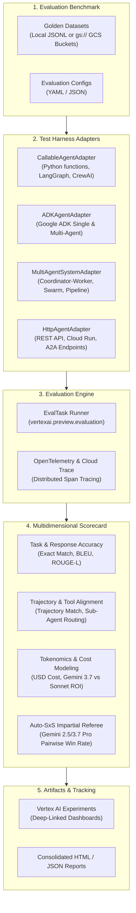

# 🧪 Universal Agent Evaluation Test Harness

[](LICENSE)
[](https://cloud.google.com/vertex-ai/generative-ai/docs/models/evaluation-overview)
[](https://github.com/google/agent-development-kit)

A decoupled, production-ready **Agent Evaluation Test Harness** for benchmarking **Mono-Agent (Single Agent)** and **Multi-Agent Systems (MAS)** across frontier LLMs on Google Cloud Vertex AI.

---

## 🏛️ Architecture Overview

The test harness separates evaluation logic from agent implementation details using an extensible **Adapter Pattern**. Any agent or multi-agent system—local or remote—can be benchmarked with zero changes to its core business logic.



---

## 🔌 Supported Agent Interfaces

| Adapter | Target Architecture | Typical Frameworks |
| :--- | :--- | :--- |
| **[`CallableAgentAdapter`](file:///Users/laah/Code/TK%20testing/agent-eval/agent-eval-framework/src/agent_eval_framework/adapters/callable_adapter.py)** | Any Python callable, function, or class | LangGraph, LangChain, CrewAI, AutoGen, Custom code |
| **[`ADKAgentAdapter`](file:///Users/laah/Code/TK%20testing/agent-eval/agent-eval-framework/src/agent_eval_framework/adapters/adk_adapter.py)** | Google ADK agents & sub-agent trees | Google Agent Development Kit (ADK) |
| **[`MultiAgentSystemAdapter`](file:///Users/laah/Code/TK%20testing/agent-eval/agent-eval-framework/src/agent_eval_framework/adapters/multi_agent_adapter.py)** | Hierarchies, Sequential pipelines, Swarms | Multi-Agent Coordinators, Router-Worker MAS |
| **[`HttpAgentAdapter`](file:///Users/laah/Code/TK%20testing/agent-eval/agent-eval-framework/src/agent_eval_framework/adapters/http_adapter.py)** | Remote deployed agent services | Cloud Run, Vertex AI Agent Engine, FastAPI, A2A |

---

## 🚀 Quickstart

### 1. Installation & Environment Setup

```bash
# Clone the test harness
git clone https://github.com/lahlfors/agent-eval.git
cd agent-eval

# Create virtual environment and install dependencies
python3 -m venv .venv
source .venv/bin/activate
pip install -e agent-eval-framework
pip install -r <(cat pyproject.toml | grep -E '^[a-zA-Z]' | sed 's/ = .*//') # or poetry install
```

Configure your `.env` file:
```bash
GOOGLE_CLOUD_PROJECT="your-gcp-project-id"
GOOGLE_CLOUD_LOCATION="us-central1"
GOOGLE_CLOUD_STORAGE_BUCKET="your-eval-bucket"
```

---

### 2. Evaluating a Mono-Agent (Single Agent)

Evaluate any standalone agent using [`CallableAgentAdapter`](file:///Users/laah/Code/TK%20testing/agent-eval/agent-eval-framework/src/agent_eval_framework/adapters/callable_adapter.py):

**Config ([`mono_agent_eval_config.yaml`](file:///Users/laah/Code/TK%20testing/agent-eval/agent-eval-framework/config/mono_agent_eval_config.yaml)):**
```yaml
experiment_name: "mono-agent-evaluation"
agent_adapter_class: "agent_eval_framework.adapters.callable_adapter.CallableAgentAdapter"

agent_config:
  target: "examples.mono_agent_example:run_agent"
  response_key: "response"
  trajectory_key: "trajectory"

dataset_path: "agent-eval-framework/data/simple.test.jsonl"
metrics:
  - "exact_match"
  - "bleu"
  - "rouge_l_sum"
  - "trajectory_exact_match"
```

**Run:**
```bash
python -c "from agent_eval_framework.runner import run_evaluation; run_evaluation('agent-eval-framework/config/mono_agent_eval_config.yaml')"
```

---

### 3. Evaluating a Multi-Agent System (MAS)

Benchmark a complex multi-agent system (Coordinator + Specialist Sub-Agents) using [`MultiAgentSystemAdapter`](file:///Users/laah/Code/TK%20testing/agent-eval/agent-eval-framework/src/agent_eval_framework/adapters/multi_agent_adapter.py):

**Config ([`multi_agent_eval_config.yaml`](file:///Users/laah/Code/TK%20testing/agent-eval/agent-eval-framework/config/multi_agent_eval_config.yaml)):**
```yaml
experiment_name: "multi-agent-system-evaluation"
agent_adapter_class: "agent_eval_framework.adapters.multi_agent_adapter.MultiAgentSystemAdapter"

agent_config:
  coordinator_entrypoint: "examples.multi_agent_example:run_multi_agent_system"
  topology: "hierarchical"
  sub_agents:
    - "ResearchSpecialist"
    - "CalculationSpecialist"

dataset_path: "agent-eval-framework/data/vertex_eval_data/golden_record_2x3_matrix.jsonl"
metrics:
  - "exact_match"
  - "bleu"
  - "trajectory_exact_match"
  - name: "cost_savings_multiplier"
    type: "custom_function"
    custom_function_path: "agent_eval_framework.metrics.tokenomics_metrics.cost_savings_multiplier"
  - name: "multi_turn_token_growth_rate"
    type: "custom_function"
    custom_function_path: "agent_eval_framework.metrics.tokenomics_metrics.multi_turn_token_growth_rate"
```

**Run:**
```bash
python -c "from agent_eval_framework.runner import run_evaluation; run_evaluation('agent-eval-framework/config/multi_agent_eval_config.yaml')"
```

---

### 4. Evaluating a Remote Deployed Agent (HTTP / REST / A2A)

Benchmark a deployed agent on Cloud Run or Vertex AI Agent Engine using [`HttpAgentAdapter`](file:///Users/laah/Code/TK%20testing/agent-eval/agent-eval-framework/src/agent_eval_framework/adapters/http_adapter.py):

**Config ([`http_agent_eval_config.yaml`](file:///Users/laah/Code/TK%20testing/agent-eval/agent-eval-framework/config/http_agent_eval_config.yaml)):**
```yaml
experiment_name: "remote-agent-evaluation"
agent_adapter_class: "agent_eval_framework.adapters.http_adapter.HttpAgentAdapter"

agent_config:
  endpoint_url: "https://your-agent-service-on-cloud-run.a.run.app/query"
  method: "POST"
  prompt_payload_key: "prompt"
  response_json_path: "response"
  trajectory_json_path: "trajectory"

dataset_path: "agent-eval-framework/data/simple.test.jsonl"
metrics:
  - "exact_match"
  - "bleu"
```

---

## 📦 Cloud Dataset Management (`tools/gcs_dataset_sync.py`)

Validate, sync, and inspect golden datasets between local files and Google Cloud Storage:

```bash
# 1. Validate dataset schema
python tools/gcs_dataset_sync.py validate agent-eval-framework/data/vertex_eval_data/golden_record_2x3_matrix.jsonl

# 2. Upload dataset to GCS
python tools/gcs_dataset_sync.py upload agent-eval-framework/data/vertex_eval_data/golden_record_2x3_matrix.jsonl --gcs-uri gs://${GOOGLE_CLOUD_STORAGE_BUCKET}/datasets/golden_2x3.jsonl

# 3. List remote datasets
python tools/gcs_dataset_sync.py list gs://${GOOGLE_CLOUD_STORAGE_BUCKET}/datasets/
```

---

## 💰 Tokenomics & Cost Advantage Metrics

The test harness includes custom metrics for calculating real-world economics and comparing models (e.g., **Gemini 3.7 Flash** vs. **Claude 3.7 Sonnet**):

* **`cost_savings_multiplier`**: Calculates the exact cost multiplier advantage (e.g., 20.0x cheaper) and dollar savings percentage.
* **`token_cost_usd`**: Exact per-query USD execution cost tracking.
* **`multi_turn_token_growth_rate`**: Detects linear vs. quadratic token accumulation in multi-turn multi-agent workflows.

---

## ⚙️ Enterprise Cloud Integrations

* **SmartEval (`smarteval_config.json`)**: Out-of-the-box configuration template for binding with Google's unified internal DAG evaluation pipeline (`go/gcp-smart-eval`).
* **Vertex AI Pipelines (`deployment/vertex_pipeline.py`)**: Distributed batch evaluation orchestrator on Vertex AI Custom Jobs.
* **Interactive Walkthrough Notebook (`notebooks/agent_eval_matrix_walkthrough.ipynb`)**: Complete Colab / Jupyter walkthrough demonstrating dataset sync, Vertex evaluation, and tokenomics charting.

---

## 🧪 Running Unit Tests

Run the full suite of unit tests verifying all adapters, metrics, and GCS tools:

```bash
pytest
```

---

## 📄 License
Apache License 2.0.
